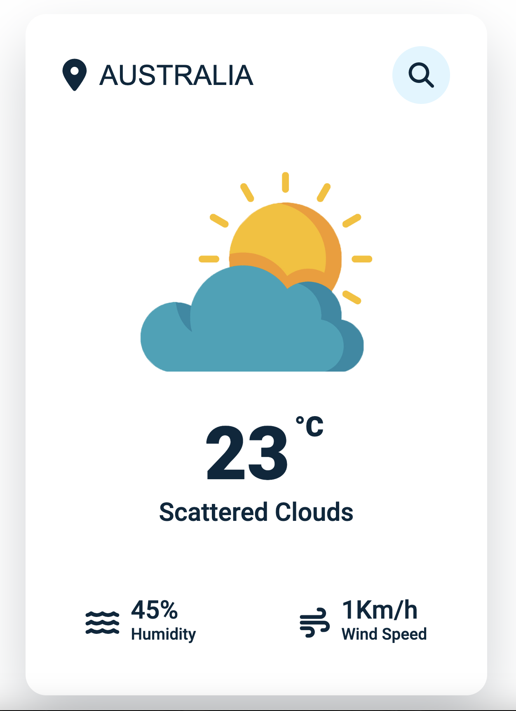

# Weather App

I am gonna showing to you how to code a weather app with javascript. in this tutorial also we use a weather api and we get data from api❗️

### Warning

You need to get your own api key :

```javascript
const APIKey = "Your Api Key";
```

# Screenshot

Here we have project screenshot :

;
